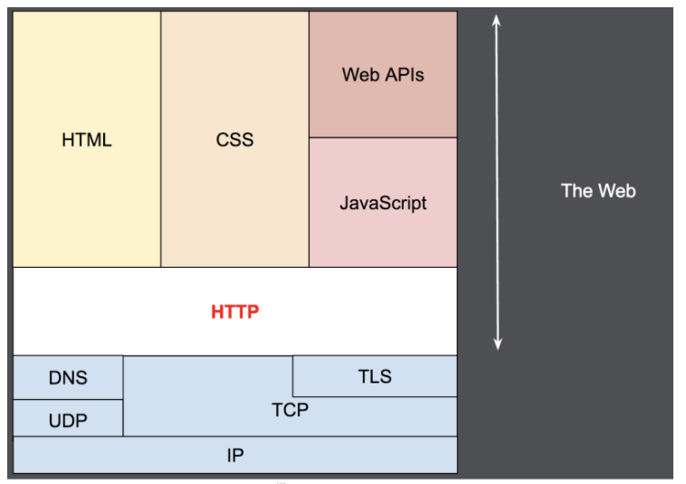

# HTTP

> 모질라 공식문서를 참고하여 작성된 문서입니다.

## HTTP의 정의

> HTTP는 HTML과 같은 하이퍼미디어 문서를 전송하기위한 **어플리케이션 레이어\(응용 계층\)** 프로토콜!

 HTTP는 클라이언트가 요청을 보내고 서버로부터 응답을 받을때 까지 대기하는 전통적인 **클라이언트-서버 모델**을 따른다. 또한 클라이언트-서버 프로토콜이기도 한데, 이는 수신자 측에 의해 요청이 초기화되는 프로토콜을 의미한다. 하나의 완전한 문서는 텍스트, 레이아웃 설명, 이미지, 비디오, 스크립트 등 불러온\(fetched\) 하위 문서들로 재구성된다.

 HTTP는 **무상태 프로토콜**이며, 이는 서버가 두 요청간에 어떠한 데이터\(상태\)도 유지하지 않음을 의미한다. 무상태란 비연결성으로 인해 서버는 클라이언트를 식별할 수 없는 것을 뜻한다. 한 마디로 클라이언트의 상태를 모른다는 것이다.

 일반적으로 안정적인 전송 계층으로, UDP와 달리 메세지를 잃지 않는 프로토콜인 TCP/IP 계층을 기반으로 사용한다.

 클라이언트와 서버들은 개별적인 메세지 교환에 의해 통신합니다. 보통 브라우저인 클라이언트에 의해 전송되는 메세지를 요청\(requests\)이라고 부르며, 그에 대해 서버에서 응답으로 전송되는 메세지를 응답\(responses\)이라고 부릅니다.

 HTTP는 응용 계층의 프로토콜로, 신뢰 가능한 전송 프로토콜이라면 이론상으로는 무엇이든 사용할 수 있으나 **TCP** 혹은 암호화된 TCP 연결인 **TLS**를 통해 전송하게 됩니다. HTTP의 확장성 덕분에, 오늘날 하이퍼텍스트 문서 뿐만 아니라 이미지와 비디오 혹은 HTML 폼 결과와 같은 내용을 서버로 포스트\(POST\)하기 위해서도 사용된다. HTTP는 또한 필요할 때마다 웹 페이지를 갱신하기 위해 문서의 일부를 가져오는데 사용될 수도 있다.

## HTTP 기반 시스템의 구성요소

 HTTP는 클라이언트-서버 프로토콜입니다. 요청은 하나의 개체, 사용자 에이전트\(또는 그것을 대신하는 **프록시**\)에 의해 전송된다. 대부분의 경우, 사용자 에이전트는 브라우저지만, 무엇이든 될 수 있다. 예를 들어, 검색 엔진 인덱스를 채워 넣고 유지하기 위해 웹을 돌아다니는 로봇이 그러한 경우이다.

 각각의 개별적인 요청들은 서버로 보내지며, 서버는 요청을 처리하고 response라고 불리는 응답을 제공한다. 이 요청과 응답 사이에는 여러 개체들이 있는데, 예를 들면 다양한 작업을 수행하는 **게이트웨이** 또는 **캐시** 역할을 하는 프록시 등이 있다.

 실제로는 브라우저와 요청을 처리하는 서버 사이에는 좀 더 많은 컴퓨터들이 존재한다. 라우터, 모뎀 등이 있다. 웹의 계층적인 설계 덕분에, 이들은 네트워크와 전송 계층 내로 숨겨진다. HTTP는 애플리케이션 계층의 **최상위**에 있다. 네트워크 문제를 진단하는 것도 중요하지만, 기본 레이어들은 HTTP의 명세와는 거의 관련이 없다.

### 클라이언트: 사용자 에이전트

 사용자 에이전트는 사용자를 대신하여 동작하는 모든 도구이다. 이 역할은 주로 브라우저에 의해 수행된다.

 브라우저는 항상 요청을 보내는 개체이다. 브라우저는 결코 서버가 될 수 없다.

 웹 페이지를 표시하기 위해, 브라우저는 페이지의 HTML 문서를 가져오기 위한 요청을 전송한 뒤, 파일을 구문 분석하여 실행해야 할 스크립트 그리고 페이지 내 포함된 하위 리소스들\(보통 이미지와 비디오\)을 잘 표시하기 위한 레이아웃 정보\(CSS\)에 대응하는 추가적인 요청들을 가져온다. 그런 뒤에 브라우저는 완전한 문서인 웹 페이지를 표시하기 위해 그런 리소스들을 혼합한다. 브라우저에 의해 실행된 스크립트는 이후 단계에서 좀 더 많은 리소스들을 가져올 수 있으며 브라우저는 그에 따라 웹 페이지를 갱신하게 된다.

 웹 페이지는 하이퍼텍스트 문서로, 표시된 텍스트의 일부는 사용자가 사용자 에이전트를 제어하고 웹을 돌아다닐 수 있도록 새로운 웹 페이지를 가져오기 위해 실행\(보통 마우스 클릭에 의해\)될 수 있는 링크임을 뜻한다. 브라우저는 HTTP 요청내에서 이런 지시 사항들을 변환하고 HTTP 응답을 해석하여 사용자에게 명확한 응답을 표시한다.

### 웹 서버

 통신 채널의 반대편에는 클라이언트에 의한 요청에 대한 문서를 제공하는 서버가 존재합니다. 서버는 사실 상 논리적으로 단일 기계이다. 이는 **로드\(로드 밸런싱\)** 혹은 그때 그때 다른 컴퓨터\(캐시, DB 서버, e-커머스 서버 등과 같은\)들의 정보를 얻고 완전하게 혹은 부분적으로 문서를 생성하는 소프트웨어의 복잡한 부분을 공유하는 서버들의 집합일 수도 있기 때문이다.

 서버는 반드시 단일 머신일 필요는 없지만, 여러 개의 서버를 동일한 머신 위에서 호스팅 할 수 있다. HTTP/1.1과 HOST 헤더를 이용하여, 동일한 IP 주소를 공유할 수도 있다.

### 프록시\(Proxy\)

 웹 브라우저와 서버 사이에서는 수많은 컴퓨터와 머신이 HTTP 메세지를 이어 받고 전달한다. 여러 계층으로 이루어진 웹 스택 구조에서 이러한 컴퓨터/머신들은 대부분은 전송, 네트워크 혹은 물리 계층에서 동작하며, 성능에 상당히 큰 영향을 주겠지만 HTTP 계층에서는 이들이 어떻게 동작하는지 눈에 보이지 않는다. 이러한 컴퓨터/머신 중에서도 응용 계층에서 동작하는 것들을 주로 프록시라고 부른다. 프록시는 눈에 보이거나 그렇지 않을 수 있으며\(프록시를 통해 요청이 변경되거나 변경되지 않을 경우를 말함\) 다양한 기능들을 수행 할 수 있다.

* 캐싱 \(캐시는 공개 또는 비공개가 될 수 있다 \(예: 브라우저 캐시\)\)
* 필터링 \(바이러스 백신 스캔, 유해 컨텐츠 차단\(자녀 보호\) 기능\)
* 로드 밸런싱 \(여러 서버들이 서로 다른 요청을 처리하도록 허용\)
* 인증 \(다양한 리소스에 대한 접근 제어\)
* 로깅 \(이력 정보를 저장\)

## HTTP의 기초적인 측면

### HTTP는 간단하다

 HTTP는 사람이 읽을 수 있도록 간단하게 고안되었다. 심지어 **HTTP/2**가 다소 복잡해졌지만 여전히 HTTP 메세지를 프레임별로 캡슐화하여 간결하게 유지하였다. HTTP 메세지들은 사람이 읽고 이해할 수 있어, 테스트하기 쉽고 초심자의 진입장벽을 낮췄다.

### HTTP는 확장 가능하다

 HTTP/1.0에서 소개된 HTTP 헤더는 HTTP를 확장하고 실험하기 쉽게 만들어주었다. 클라이언트와 서버가 새로운 헤더의 **시멘틱**에 대해 간단한 합의만 한다면, 언제든지 새로운 기능을 추가할 수 있다.

### HTTP는 상태는 없지만, 세션은 있다

 HTTP는 상태를 저장하지 않는다\(Stateless 무상태\). 동일한 연결 상에서 연속하여 전달된 두 개의 요청 사이에는 연결고리가 없다. 

